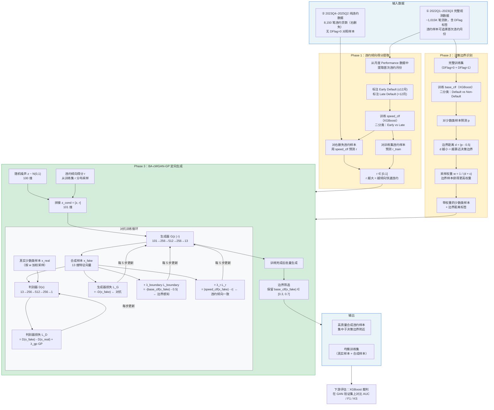

# BA-cWGAN-GP 算法流程图



## 流程图说明

### 颜色含义

| 颜色 | 模块 | 含义 |
|---|---|---|
| 蓝色边框 | 输入数据 / 最终输出 | 数据流入流出 |
| 黄色边框 | Phase 1 & 2 | 信息提取阶段（为生成做准备） |
| 绿色边框 | Phase 3 | 核心生成阶段（本文创新点） |

### 数据流向

```
完整观测数据 ──→ Phase 1 (speed_clf) ──→ r ──┐
         │                                      ├──→ Phase 3 (BA-cWGAN-GP) ──→ 合成样本
         └──→ Phase 2 (base_clf) ──→ d, w ──┘
                                                      │
右删失违约数据 ──→ Phase 1 (仅预测 r) ──────────────────┘
```

### 三项损失的分工

| 损失项 | 公式 | 告诉生成器什么 |
|---|---|---|
| 对抗损失 L_adv | -D(G(z\|r)) | "生成样本要像真的违约样本" |
| 边界损失 L_boundary | -\|base_clf(x_fake) - 0.5\| | "要在分类器最拿不准的地方生成" |
| r 一致性损失 L_r | \|speed_clf(x_fake) - r\| | "违约速度模式要和条件 r 一致" |

---

*配合 `BA-cWGAN-GP_方法论详解.md` 第三节阅读*
